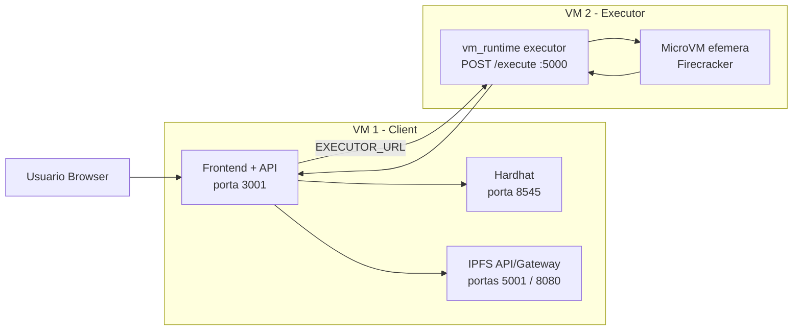

# DNAT em Duas VMs

Este projeto pode ser separado em duas VMs com a seguinte responsabilidade:

- `VM 1 - Client`: frontend web, Hardhat local e IPFS local
- `VM 2 - Executor`: `vm_runtime` e microVMs Firecracker

## Topologia



## Requisito importante

O executor usa Firecracker e KVM. Isso significa:

- a `VM 2` precisa ser Linux
- `/dev/kvm` precisa existir na `VM 2`
- se o executor rodar em Docker, o contêiner precisa de `--privileged` e acesso a `/dev/kvm`

Se a sua VM não oferece nested virtualization, a parte da microVM não vai funcionar mesmo que o contêiner suba.

## VM 1 - Client

Na VM do frontend, defina o IP privado da VM do executor:

```bash
export EXECUTOR_URL=http://10.0.0.20:5000
docker compose -f docker/frontend-vm.compose.yaml up --build -d
```

Depois valide:

```bash
curl http://localhost:3001/api/health
curl http://localhost:3001/api/contract-info
curl http://localhost:5001/api/v0/version -X POST
```

URLs esperadas:

- `http://<ip-da-vm1>:3001/`
- `http://<ip-da-vm1>:3001/assets.html`
- `http://<ip-da-vm1>:3001/executions.html`

## VM 2 - Executor

### Opcao recomendada: rodar no host Linux

```bash
cd vm_runtime
bash setup-local.sh
python3 executor.py 5000
```

Teste local do endpoint:

```bash
curl http://localhost:5000/execute -X POST --data-binary @test-bundle/bundle.tar.gz
```

### Opcao com Docker

```bash
docker compose -f docker/executor-vm.compose.yaml up --build -d
```

Validacoes uteis:

```bash
curl http://localhost:5000/execute -X POST --data-binary @test-bundle/bundle.tar.gz
docker logs dnat-executor
ls -l /dev/kvm
```

## Teste ponta a ponta

Com as duas VMs no ar:

1. Abra `http://<ip-da-vm1>:3001/`.
2. Registre um dataset e uma application.
3. Compre acesso aos assets.
4. Execute `run-from-cids` pela UI.
5. Confira o resultado em `http://<ip-da-vm1>:3001/executions.html`.

Fluxo esperado:

1. O frontend envia arquivos ao IPFS local da `VM 1`.
2. O contrato no Hardhat registra os CIDs.
3. A API da `VM 1` baixa os CIDs do IPFS e monta `bundle.tar.gz`.
4. A API chama `http://<ip-da-vm2>:5000/execute`.
5. O executor sobe uma microVM, roda o bundle, devolve JSON e apaga a microVM.

## Checklist de rede

- `VM 1 -> VM 2:5000` liberado
- `Browser -> VM 1:3001` liberado
- `VM 1` nao precisa expor `8545` e `5001` publicamente se voce for usar apenas a UI
- `VM 2` nao precisa expor nada alem de `5000`

## O que eu consegui validar daqui

Eu validei a configuracao e corrigi a incompatibilidade entre o runtime Docker do executor e o script `run-vm.sh`.

Eu nao consegui executar o teste real de microVM neste ambiente porque isso depende de:

- Docker build com download de dependencias
- Linux com KVM disponivel
- permissao para subir Firecracker

Entao o teste funcional final precisa ser feito nas suas VMs Linux.
